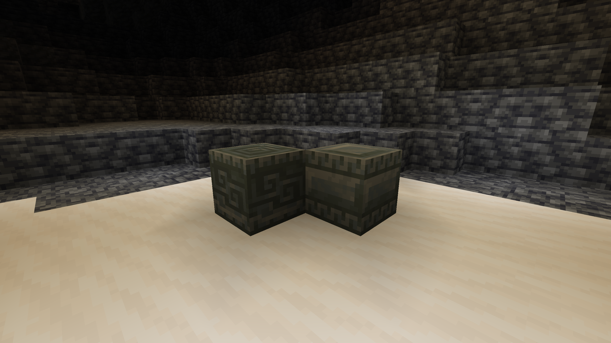

# Tuff Backport

## About
This is the first Mod that I have published, expect issues and bugs.\
This simply ports over all tuff-related blocks from 1.20/1.21 to 1.18.\
This imports all crafting recipes and lang files from 1.20/1.21 to 1.18.

## Credits
All Assets and models belong to Minecraft, thank you to [Sir_BananaCat](https://www.curseforge.com/members/sir_bananacat/projects) for helping with publishing and to the Salmon Pants Crew for assisting as well

## Screenshots
Tuff Stairs, Wall and Slab

Tuff Bricks, Brick Wall, and Brick Slab
 
Polished Tuff Block, Stairs, Wall, and Slab

Chiseled Tuff Block and Bricks 

